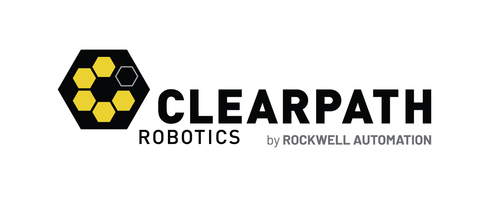

&nbsp;

# Build/Install/Run on Robot PC

## Install

```
cd ~
mkdir -p onav_ws/src
cd ~/onav_ws/src/
git clone https://github.com/cpr-application/clearpath_outdoornav.git
cd ~/onav_ws/
rosdep install --from-paths src --ignore-src -r -y
cd ~/onav_ws/ && colcon build --packages-up-to clearpath_outdoornav_msgs
```

## Build

```
cd ~/onav_ws/ && colcon build --symlink-install --packages-up-to clearpath_outdoornav_python_api
```

### Run API Endpoint Example

Each endpoint might have their own specific parameters that need to be set prioro to running the script.

1. Open the corresponding endpoint python file (eg. [mission endpoint file](endpoints/autonomy/mission.py)).
2. Add in the requested values that near the top of the file (denoted by a TODO tag)

```
source ~/onav_ws/install/setup.bash
ros2 run clearpath_outdoornav_python_api <endpoint_example>
```

where <example_endpoint> is the name of one of the endpoint examples (See [setup.py](setup.py) for the list of all available endpoint and application examples)

### Run API Application Example

1. Open the corresponding example python file (eg. [looped mission example file](examples/mission_looped.py)).
2. Add in the requested values that near the top of the file (denoted by a TODO tag)

```
source ~/onav_ws/install/setup.bash
ros2 run clearpath_outdoornav_python_api <application_example>
```

where <application_example> is the name of one of the application examples (See [setup.py](setup.py) for the list of all available endpoint and application examples)


# Build/Install/Run on Remote PC
